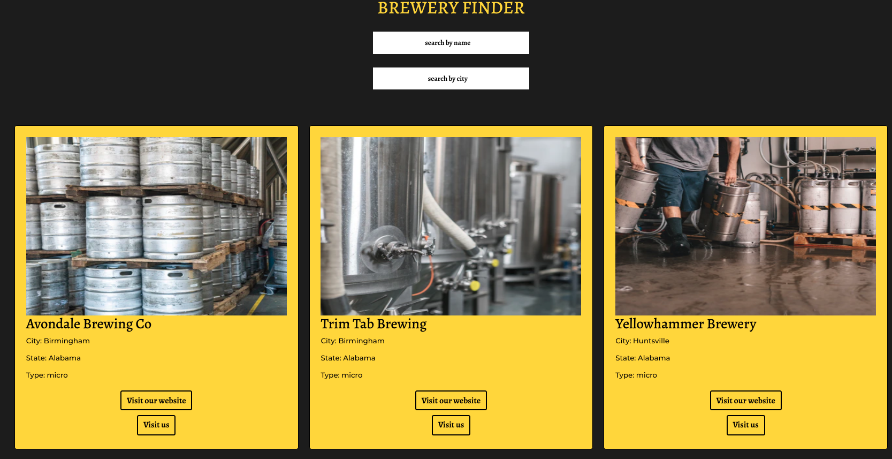

 

Using the OpenBrewery API we created with React a brewery finder application where beer enthusiasts can find a place to go and try new flavors.

 

We used React Bootstrap for the design and included a location feature using the Google Maps API so our users can see the exact location of our breweries. Our cards change dynamically when you look through them by name or city.

 
 

 
 

# [See Project GitHub Repo](https://github.com/juanjpayan/Brewery-Finder)
